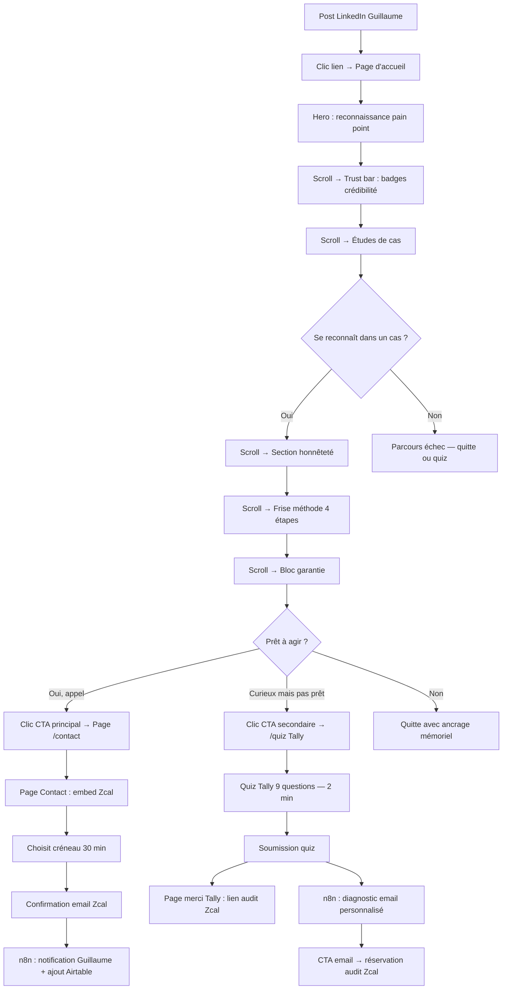
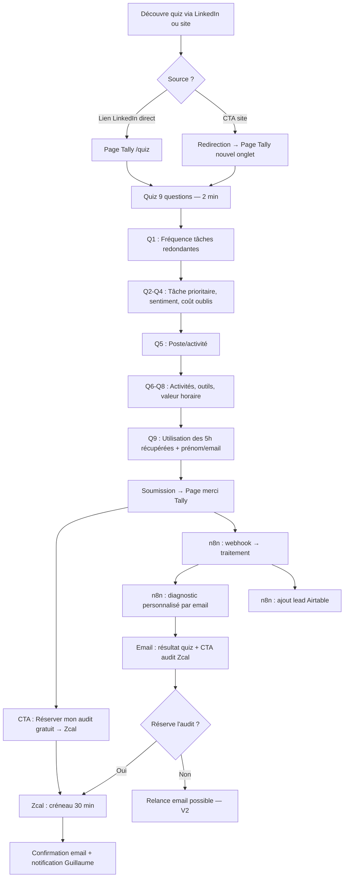
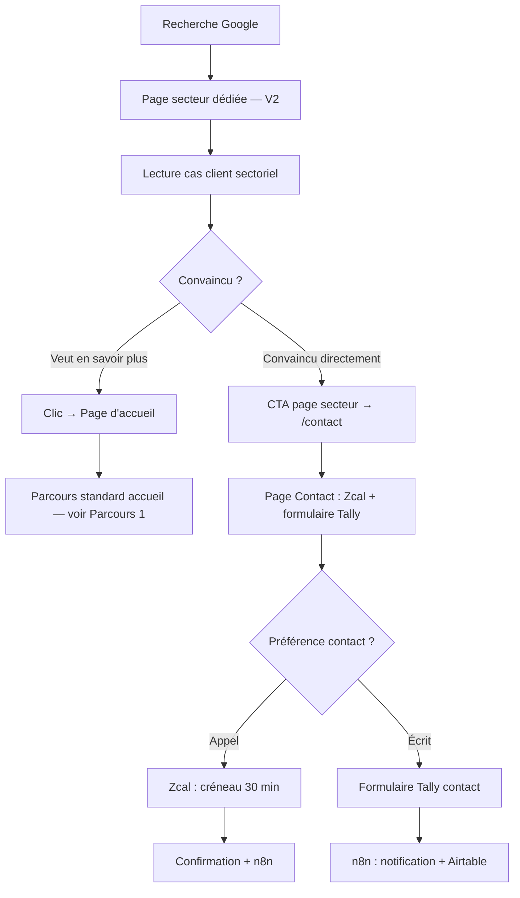
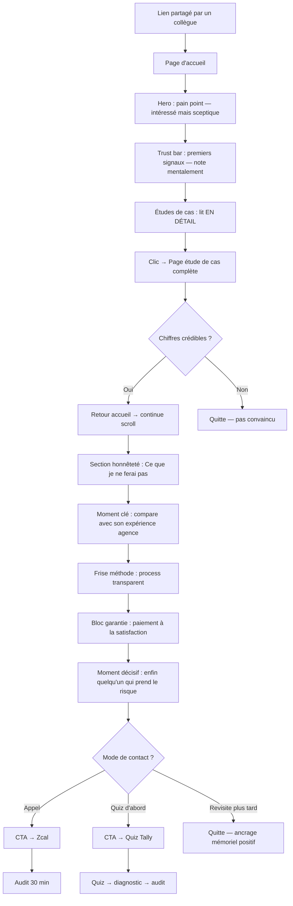
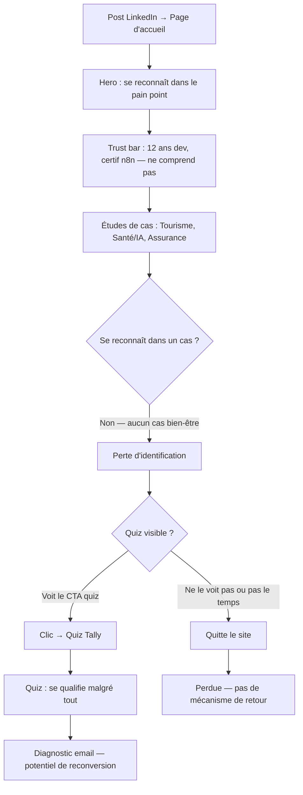
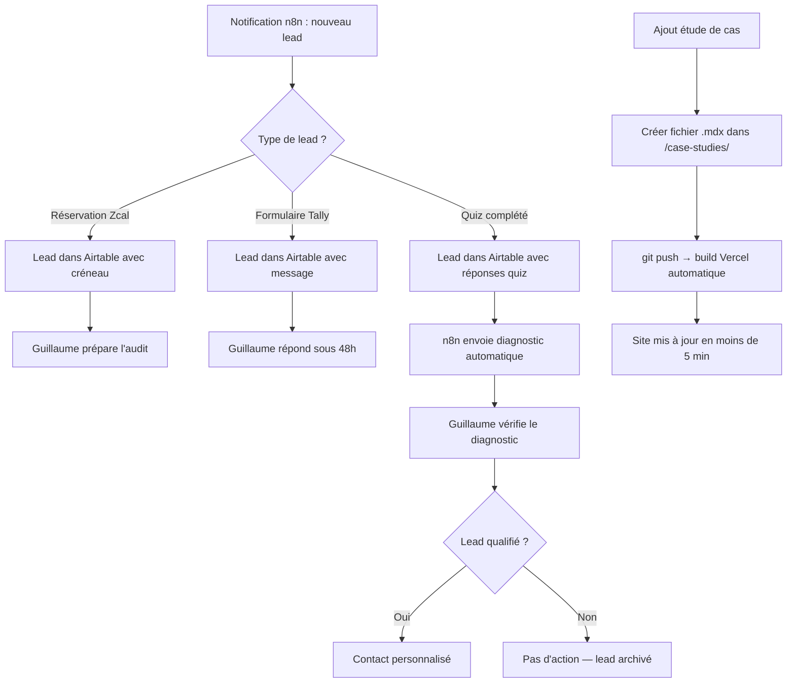

# UX Design Specification appvise_consulting

**Author:** Onizuka
**Date:** 2026-03-21

---

<!-- UX design content will be appended sequentially through collaborative workflow steps -->

## Executive Summary

### Vision projet

Site vitrine/conversion pour Appvise Consulting destiné à transformer la présence LinkedIn de Guillaume Occuly en canal d'acquisition autonome. Le site cible les entrepreneurs non-techniques (solopreneurs, petites équipes de 2-5 personnes) qui perdent 10-15h/semaine sur des tâches administratives répétitives. Le mécanisme de conversion central repose sur l'identification : le visiteur se reconnaît dans un cas client concret et comprend que son problème a déjà été résolu. L'entonnoir de conviction structure le parcours en trois temps — Pain point → Preuves chiffrées → Garantie paiement à la satisfaction — pour pousser vers un audit gratuit de 30 minutes.

### Utilisateurs cibles

**Sophie (coach bien-être)** — 32-45 ans, solopreneur, non-technique. Perd 10-12h/semaine sur l'admin. Déclencheur émotionnel : un impayé ou un client perdu. Sensible aux résultats concrets et à la simplicité. Budget : 1 500-2 500€.

**Thomas (consultant stratégie/finance)** — 35-48 ans, plafonne à 12k€/mois. Préfère l'écrit au téléphone. A déjà investi chez une agence sans résultat satisfaisant. Sensible au modèle de paiement et au diagnostic "juste ce qu'il faut". Budget : 2 000-3 500€.

**Lucas (dirigeant organisme formation Qualiopi)** — 40-55 ans, petite équipe. Perd 15h/semaine sur l'admin (certificats conformes). ROI attendu en moins d'un mois. Client le plus rentable et le plus urgent. Budget : 3 000-5 000€.

**Marc (le déçu du freelance/agence)** — Tous secteurs, a déjà investi 3-10k€ sans résultat. Méfiance maximale. Cherche des garanties et de la transparence. Sensible au "paiement à la satisfaction" et au process en 4 étapes.

**Guillaume (admin du site)** — Fondateur, gère les leads au quotidien. A besoin d'ajouter du contenu (études de cas, blog V2) sans intervention dev. Suit les KPIs et les conversions.

### Défis UX clés

1. **Conversion mobile-first** — Le trafic LinkedIn est majoritairement mobile. L'entonnoir de conviction (scroll long, études de cas, double CTA) doit rester fluide et engageant sur petit écran sans sacrifier la profondeur du contenu.
2. **Désarmer la méfiance rapidement** — Le persona "déçu du freelance" a besoin de signaux de confiance visuels forts dès les premières secondes : garantie visible above-the-fold, process transparent, cas clients chiffrés accessibles immédiatement.
3. **Identification sectorielle rapide** — Le visiteur doit pouvoir se reconnaître dans un cas client en moins de 10 secondes de scroll. Sans identification, il quitte (cf. parcours d'échec Nadia).

### Opportunités de design

1. **Storytelling immersif par les cas clients** — Le format narratif (prénom + métier + problème + résultat chiffré avant/après) crée une connexion émotionnelle plus forte que des témoignages génériques. C'est un différenciateur UX vis-à-vis des concurrents.
2. **Process transparent comme signature visuelle** — La frise "Ma méthode" en 4 étapes (Diagnostic → Proposition → Réalisation → Paiement) peut devenir l'élément visuel signature du site, mémorisable et rassurant.
3. **Quiz comme micro-engagement** — Le quiz "Combien d'heures perds-tu chaque semaine ?" qualifie le visiteur tout en l'éduquant sur son propre problème — un hook d'engagement qui prépare naturellement la conversion vers l'audit.

## Core User Experience

### Expérience fondamentale

L'expérience coeur du site est un **parcours de conviction en une visite** : le visiteur arrive (majoritairement via LinkedIn), se reconnaît dans un problème concret, voit la preuve chiffrée que ce problème a été résolu pour quelqu'un comme lui, puis découvre que le risque est nul (garantie paiement à la satisfaction). La combinaison identification + garantie est le déclencheur de conversion — ni l'un ni l'autre ne suffit seul.

Le site supporte **trois parcours de conversion distincts** de poids égal :
1. **Identification directe → Audit** (Sophie, Marc) — études de cas + garantie → réservation Zcal ou formulaire Tally
2. **Quiz → Audit** (Lucas) — auto-diagnostic + éducation au problème → diagnostic email → réservation audit
3. **SEO → Audit** (Thomas, V2) — page secteur → cas client sectoriel → audit

### Stratégie plateforme

**Web responsive mobile-first** — site multi-pages (MPA) avec génération statique (SSG).

| Plateforme | Priorité | Justification |
|-----------|----------|---------------|
| Mobile (320-767px) | Primaire | Trafic LinkedIn majoritairement mobile |
| Desktop (1024px+) | Secondaire | Consultations approfondies, comparaison |
| Tablette (768-1023px) | Tertiaire | Layout adaptatif, pas de design spécifique |

**Interaction** : tactile sur mobile (scroll, tap), souris/clavier sur desktop. Pas de fonctionnalité offline. Pas de capacité device-specific requise.

### Interactions sans friction

1. **Scroll vertical fluide continu** — Le parcours de conviction se déroule naturellement par scroll vertical sans interruption ni clic intermédiaire. Le visiteur LinkedIn scrolle déjà — on prolonge ce geste. Sticky CTA en bas d'écran mobile pour que l'action soit toujours accessible sans remonter.
2. **Double CTA sans choix paralysant** — Zcal (booking) et Tally (formulaire écrit) sont présentés côte à côte avec un libellé clair sur la différence : "Réserver un appel" vs "Écrire un message". Le visiteur choisit selon sa préférence sans hésitation.
3. **Quiz auto-contenu** — Le quiz Tally s'ouvre inline (pas de redirection vers un site tiers). Le visiteur reste dans le flux du site. Le diagnostic arrive par email — zéro friction post-complétion.
4. **Navigation par ancres dans le header** — Menu compact (Accueil, Cas clients, Quiz, Contact) avec scroll smooth vers les sections. Pas de rechargement de page pour les éléments de la page d'accueil.

### Moments critiques de succès

1. **"C'est moi ça"** — Le visiteur lit une étude de cas et se reconnaît dans le profil décrit (prénom + métier + problème). Ce moment d'identification est le premier déclencheur. S'il ne se produit pas en < 10 secondes de scroll, le visiteur quitte (cf. parcours Nadia). Design implication : les cas clients doivent être visibles très tôt dans le scroll, avec des labels sectoriels lisibles.

2. **"Ah, je ne risque rien"** — Le visiteur découvre le modèle paiement à la satisfaction. Ce moment élimine la dernière barrière, surtout pour le persona déçu du freelance. Design implication : la garantie doit être un bloc visuel fort, pas un texte noyé dans un paragraphe.

3. **"Je comprends ce qui va se passer"** — La frise 4 étapes rend le process transparent. Le visiteur sait exactement à quoi s'attendre avant de s'engager. Design implication : la frise doit être visuelle, séquentielle, et positionnée entre les preuves et le CTA.

4. **"Mon problème a un coût"** — Le quiz fait réaliser au visiteur combien d'heures/argent il perd. Ce moment éducatif transforme un besoin vague en urgence quantifiée. Design implication : le résultat du quiz doit frapper (chiffre mis en évidence).

### Principes d'expérience

1. **Identification avant argumentation** — Montrer un cas client concret avant d'expliquer l'offre. Le visiteur doit se reconnaître avant d'écouter.
2. **Éliminer le risque perçu, pas le vendre** — La garantie paiement à la satisfaction se montre, elle ne se dit pas. Bloc visuel fort, pas de disclaimer légal.
3. **Un seul flux, aucun cul-de-sac** — Chaque section pousse naturellement vers la suivante. Pas de page orpheline, pas de navigation sans issue. Le scroll est le parcours.
4. **Tutoiement direct, ton de Guillaume** — Le site parle comme Guillaume sur LinkedIn : direct, concret, sans jargon technique. Le visiteur doit sentir qu'il parle à une personne, pas à une entreprise.
5. **Mobile = parcours principal** — Chaque décision de design est prise pour mobile d'abord. Le desktop enrichit, il ne définit pas.

## Desired Emotional Response

### Objectifs émotionnels primaires

1. **Crédibilité incarnée** — "Ce type est sérieux et transparent." Le visiteur repart avec la conviction que Guillaume est compétent et honnête, même s'il ne convertit pas immédiatement. C'est l'émotion socle — sans elle, rien d'autre ne fonctionne.

2. **Soulagement** — "Enfin quelqu'un qui peut résoudre ça." Le visiteur comprend que son problème n'est pas unique, qu'il a déjà été résolu, et que la solution est accessible. Le poids de l'admin quotidienne se transforme en perspective de libération.

3. **Confiance sans risque** — "Je ne risque rien à essayer." Le modèle paiement à la satisfaction + audit gratuit élimine la peur de se faire avoir. Le visiteur passe de la méfiance à l'ouverture.

4. **Mémorabilité référente** — "Si quelqu'un autour de moi a ce problème, je penserai à lui." Le visiteur ancre Guillaume comme la référence pour l'automatisation/dev, même sans besoin immédiat. Le site crée un souvenir assez fort pour déclencher une recommandation future.

### Cartographie émotionnelle du parcours

| Étape du parcours | Émotion d'arrivée | Émotion de sortie | Levier UX |
|---|---|---|---|
| **Headline / Hero** | Curiosité (clic LinkedIn) | Reconnaissance — "c'est moi ça" | Pain point formulé avec les mots du visiteur |
| **Études de cas** | Intérêt prudent | Soulagement + projection — "ça a marché pour quelqu'un comme moi" | Format narratif : prénom, métier, chiffres avant/après |
| **Frise Ma méthode** | Questionnement — "comment ça marche ?" | Clarté + confiance — "je sais exactement ce qui va se passer" | Frise visuelle séquentielle, 4 étapes claires |
| **Garantie** | Méfiance résiduelle | Sécurité — "je ne risque rien" | Bloc visuel fort, modèle expliqué simplement |
| **CTA audit** | Hésitation | Passage à l'action sans pression — "au pire c'est gratuit" | Double option (appel / écrit), zéro engagement |
| **Quiz** | Curiosité ludique | Prise de conscience — "mon problème a un coût" | Chiffre final mis en évidence (heures/argent perdus) |
| **Post-visite (sans conversion)** | — | Ancrage mémoriel — "je sais où aller si besoin" | Tonalité personnelle de Guillaume, cas clients marquants |

### Micro-émotions critiques

**À cultiver :**
- **Confiance → Transparence** — Chaque élément du site montre le process, les chiffres, le modèle. Rien n'est caché.
- **Reconnaissance → Appartenance** — Le visiteur se sent compris ("il parle de mon quotidien") plutôt que ciblé par du marketing.
- **Accomplissement anticipé** — Les chiffres avant/après des cas clients font visualiser le résultat avant même de commencer.

**À éviter absolument :**
- **Pression commerciale** — Pas de compte à rebours, pas de "offre limitée", pas de pop-up agressif. Le CTA est disponible, jamais imposé.
- **Complexité technique** — Zéro jargon (pas de "API", "webhook", "SSG"). Le visiteur ne doit jamais se sentir incompétent.
- **Opacité** — Pas de "contactez-nous pour un devis". Le process est visible, les fourchettes de prix sont dans l'audit, le modèle de paiement est expliqué sur le site.
- **Sentiment d'être un numéro** — Le tutoiement, la photo de Guillaume, le ton direct contrent l'impression "agence impersonnelle".

### Implications design

| Objectif émotionnel | Décision UX |
|---|---|
| Crédibilité incarnée | Photo de Guillaume visible tôt dans le scroll, ton direct "je/tu", lien YouTube comme preuve de compétence |
| Soulagement | Cas clients au-dessus de la ligne de flottaison mobile (résumé visible sans clic), chiffres en gros |
| Confiance sans risque | Bloc garantie visuellement distinct (fond contrasté, icône bouclier), positionné avant le CTA principal |
| Mémorabilité référente | Frise "Ma méthode" comme signature visuelle mémorisable, nom "Appvise" associé à un résultat concret |
| Anti-pression | CTA discret mais permanent (sticky bar), libellé neutre ("Réserver un audit gratuit" plutôt que "Profitez-en maintenant") |
| Anti-jargon | Vocabulaire centré résultat dans toute l'interface ("Tes factures partent seules" plutôt que "Automatisation de facturation via API") |

### Principes de design émotionnel

1. **Montrer, ne pas convaincre** — Les cas clients chiffrés et le modèle de paiement parlent d'eux-mêmes. Pas de superlatifs ("le meilleur", "expert reconnu"), que des faits.
2. **Rassurer par la structure, pas par les mots** — La frise 4 étapes et le layout prévisible créent la confiance. Le visiteur sait toujours où il en est dans le parcours.
3. **Personnaliser par le ton, pas par la technologie** — Le tutoiement et le style Guillaume remplacent la personnalisation algorithmique. Simple et humain.
4. **Laisser partir sans friction** — Un visiteur qui ne convertit pas aujourd'hui doit repartir avec une image positive et un souvenir net. Pas de pop-up de rétention, pas de culpabilisation.

## UX Pattern Analysis & Inspiration

### Analyse des produits inspirants

**clairenocode.fr** — Freelance no-code/automatisation (concurrent indirect)
- Tonalité personnelle efficace ("Hello, moi c'est Claire") + chiffres concrets (5h/semaine économisées, 40+ clients)
- Section "Je ne vais pas vous dire que..." : pattern honnêteté qui désarme la méfiance avant de vendre
- 3 piliers d'offres distincts (formation / sur-mesure / communauté)
- Faiblesses : pas de garantie visible, pricing opaque, pas de FAQ

**selfupgrade.fr** — Consulting IA/entrepreneuriat
- Social proof multiforme : logos clients + avis carousel + publications presse/podcast
- Répétition CTA stratégique (3-4 fois dans le scroll) sans agressivité
- Design dark + gradient doré = identité visuelle forte et mémorisable
- Hiérarchie gratuit/payant claire avec emojis distinctifs
- Faiblesses : trop de contenu dilue la conversion, pas de garantie, pas de FAQ

**clbge.com** — Cabinet géomètre-expert (service professionnel B2B/B2C)
- Trust bar horizontale sous le hero : badges de crédibilité immédiats (Ordre, couverture géo, paiement sécurisé, réponse 24h)
- Timeline 5 étapes avec connecteurs visuels : démystifie le process client
- Double CTA dès le hero (RDV + diagnostic gratuit) : options pour engagements différents
- Spacing généreux, typographie Inter, positionnement premium
- Faiblesses : pas de témoignages clients, pas de cas concrets, blog vide

**maison-ayaba.com** — Location haut de gamme (conversion directe)
- Minimalisme épuré : blanc/gris/teintes naturelles, photos authentiques de qualité
- Pricing transparent dès le hero (dès 60€/nuit) + offre du moment sans urgence agressive
- Structure comparative : 3 formules avec layout identique répété = comparaison sans effort
- Badge "Le plus populaire" : nudge subtil, oriente sans imposer
- Faiblesses : pas de témoignages, slider desktop pas optimal

**lemlist.com** — SaaS cold outreach (cas clients chiffrés)
- Études de cas avec chiffres avant/après en gros caractères
- Frise "How it works" en 3-4 étapes visuelles
- CTA unique répété, entonnoir simple : problème → preuve → action

**alan.com** — Assurance santé (transparence et confiance)
- Design épuré avec beaucoup d'espace blanc
- Process transparent expliqué visuellement étape par étape
- Tonalité directe anti-corporate, mobile-first exemplaire

### Patterns UX transférables

**Pattern 1 : Trust bar horizontale** (source : clbge.com)
Bande de badges sous le hero avec icônes + texte court. Transférable directement pour : +12 ans exp, double certif n8n, paiement à la satisfaction, audit gratuit, un seul interlocuteur.

**Pattern 2 : Timeline processuelle visuelle** (sources : clbge.com, alan.com, lemlist.com)
Frise numérotée avec connecteurs visuels pour "Ma méthode" en 4 étapes. Combine la clarté de clbge (connecteurs) avec la simplicité de lemlist (3-4 étapes max).

**Pattern 3 : Section honnêteté/anti-patterns** (source : clairenocode.fr)
Section "Ce que je ne ferai pas" ou "Pas de..." qui désarme la méfiance en nommant les anti-patterns des agences/freelances. Directement aligné avec PE2 du PRD et le persona Marc.

**Pattern 4 : Tonalité personnelle incarnée** (sources : clairenocode.fr, clbge.com)
Photo + prénom + bio courte + tutoiement. Le visiteur parle à Guillaume, pas à "Appvise Consulting". Renforce le différenciateur "un seul interlocuteur".

**Pattern 5 : Social proof multiforme** (source : selfupgrade.fr)
Logos clients en carousel + chiffres concrets + cas narratifs. Trois couches de preuve qui se renforcent mutuellement.

**Pattern 6 : Minimalisme premium** (source : maison-ayaba.com)
Espace blanc généreux, photos authentiques, palette sobre. Contre-intuitif pour un site de conversion mais crée une impression de sérieux et de confiance — exactement ce dont Marc (le méfiant) a besoin.

**Pattern 7 : Double CTA permanent** (sources : clbge.com, maison-ayaba.com)
Deux options d'engagement (appel/écrit ou booking/formulaire) présentées côte à côte. Reconnaît deux profils de visiteurs sans créer de choix paralysant.

### Anti-patterns à éviter

1. **Surcharge de contenu** (cf. selfupgrade.fr) — Trop de sections (podcast, blog, newsletter, formations, communauté) dilue l'objectif de conversion. Appvise MVP = un seul objectif : audit gratuit.
2. **Pricing opaque** (cf. clairenocode.fr) — "Contactez-nous pour un devis" crée de la méfiance. Le process et le modèle de paiement doivent être visibles sur le site.
3. **Carousel automatique d'avis** (cf. selfupgrade.fr) — La rotation auto peut créer de la fatigue cognitive et empêche la lecture complète. Préférer des cas clients statiques et complets.
4. **Blog vide / pages en construction** (cf. clbge.com, clairenocode.fr) — Ne pas afficher de section blog tant que le contenu n'existe pas. Mieux vaut un site complet sans blog qu'un site avec un blog vide.
5. **Absence de garantie** (cf. clairenocode.fr, selfupgrade.fr) — Les deux concurrents les plus proches n'affichent aucune garantie. C'est une opportunité de différenciation pour Appvise avec le modèle paiement à la satisfaction.

### Stratégie d'inspiration design

**À adopter directement :**
- Trust bar horizontale avec icônes (clbge.com) → badges de réassurance Appvise
- Timeline processuelle numérotée (clbge.com) → frise "Ma méthode" 4 étapes
- Double CTA hero (clbge.com) → Zcal + Tally dès le hero
- Section honnêteté anti-patterns (clairenocode.fr) → désarmer Marc
- Tonalité personnelle prénom + photo (clairenocode.fr) → incarner Guillaume

**À adapter :**
- Social proof multiforme (selfupgrade.fr) → simplifier en cas clients narratifs chiffrés (pas de carousel auto, pas de logos sans contexte)
- Minimalisme premium (maison-ayaba.com) → appliquer le spacing généreux et la sobriété visuelle tout en gardant la densité informationnelle nécessaire à la conviction
- Pricing transparent (maison-ayaba.com) → pas de grille tarifaire, mais le modèle de paiement expliqué clairement (acompte + solde satisfaction)

**À éviter :**
- Surcharge de sections (selfupgrade.fr) → MVP focalisé sur un seul objectif : audit gratuit
- Carousel auto d'avis (selfupgrade.fr) → cas clients statiques et complets
- Sections vides ou en construction → ne rien afficher qui ne soit pas prêt

## Design System Foundation

### Choix du design system

**Approche : Tailwind CSS (Themeable System) sur Next.js**

Pas de component library tierce (MUI, Chakra, shadcn/ui). Le site est principalement du contenu statique + embeds — les composants nécessaires (trust bar, timeline, cards cas clients, sticky CTA) sont simples et mieux maîtrisés en Tailwind utility-first.

### Justification du choix

| Critère | Décision | Raison |
|---------|----------|--------|
| Framework | Next.js (App Router, SSG) | Génération statique pour la performance, routing pages, ISR pour les mises à jour de contenu |
| Styling | Tailwind CSS | Utility-first, mobile-first natif (sm:/md:/lg:), design tokens via tailwind.config |
| Component library | Aucune (composants custom) | Site de contenu avec embeds, pas d'app complexe. Composants simples faits sur mesure |
| Typographie | Variable font (Inter ou similaire) | Inspiré de clbge.com — moderne, lisible, léger en poids |
| Icônes | Lucide React ou Heroicons | Léger, cohérent, compatible Tailwind |
| Animations | CSS natif + Tailwind transitions | Pas de librairie d'animation lourde. Scroll smooth, transitions hover, reveal au scroll |
| CMS contenu | Markdown (fichiers .md/.mdx) | Guillaume ajoute une étude de cas = créer un fichier markdown + redéployer |
| Déploiement | Vercel (natif Next.js) | Build + deploy automatique en < 5 min, preview branches, analytics intégrés |

### Approche d'implémentation

**Architecture des composants :**
- `HeroSection` — headline pain point + double CTA (Zcal + Tally)
- `TrustBar` — bande horizontale de badges avec icônes
- `CaseStudyCard` — card étude de cas (prénom, métier, chiffres avant/après)
- `MethodTimeline` — frise 4 étapes avec connecteurs visuels
- `GuaranteeBlock` — bloc garantie paiement à la satisfaction (fond contrasté)
- `QuizEmbed` — embed Tally inline pour le quiz
- `BookingEmbed` — embed Zcal pour la réservation
- `ContactForm` — embed Tally formulaire alternatif
- `StickyCTA` — barre CTA fixe en bas d'écran mobile
- `Navbar` — navigation avec ancres + menu mobile hamburger

**Génération statique (SSG) :**
- Pages de contenu générées au build (`generateStaticParams`)
- Études de cas en fichiers MDX, rendues statiquement
- Embeds Tally/Zcal chargés côté client en lazy loading (pas de SSR pour les iframes)

### Stratégie de personnalisation

**Design tokens (tailwind.config) :**

Palette à définir à l'étape visual design :
- `primary` — couleur principale Appvise
- `accent` — couleur d'accent CTA
- `neutral` — gris/fonds
- `surface` — fonds de sections alternées
- `guarantee` — fond bloc garantie (distinct)

Typographie :
- Font principale : Inter Variable (ou similaire), fallback system-ui, sans-serif
- Font titres : identique (cohérence minimaliste)

Spacing — généreux, inspiré maison-ayaba/clbge :
- Section desktop : 5rem
- Section mobile : 3rem

**Breakpoints (mobile-first) :**
- Default : mobile (320-767px) — parcours principal
- `md:` : tablette (768-1023px)
- `lg:` : desktop (1024px+)

**Performance :**
- Tailwind purge en production → CSS < 10 KB
- Next.js Image component pour optimisation automatique des images
- Embeds en lazy loading (`loading="lazy"`) pour ne pas bloquer le LCP
- Score Lighthouse cible > 90 garanti par l'architecture SSG + Tailwind

## Expérience utilisateur fondamentale

### Expérience définissante

> "Tu lis l'histoire de quelqu'un comme toi qui a résolu son problème, et tu réserves un audit gratuit sans risque."

L'expérience fondamentale d'Appvise n'est pas une interaction technique — c'est un **parcours de conviction par scroll**. Le produit, c'est le contenu et sa séquence. Le visiteur ne "fait" rien de complexe : il scrolle, il se reconnaît, il est rassuré, il agit.

### Modèle mental de l'utilisateur

**Contexte d'arrivée :** Le visiteur vient de LinkedIn. Il a vu un post de Guillaume qui parle d'un résultat concret (ex : "Ma cliente coach économise 10h/semaine"). Il a déjà un aperçu de l'offre. Ce qu'il cherche sur le site :

1. **D'abord : valider la crédibilité** — "Ce type est-il sérieux ? Est-ce que ça marche vraiment ?" → Il cherche des preuves (cas clients, chiffres, parcours)
2. **Ensuite : comprendre l'offre** — "Qu'est-ce qu'il peut faire pour moi exactement ? Combien ça coûte ? Comment ça se passe ?" → Il cherche de la clarté (frise méthode, garantie, modèle de paiement)

**Implication design critique :** La séquence de scroll doit respecter cet ordre mental. Si l'offre arrive avant les preuves, le visiteur décroche ("encore un qui vend avant de prouver"). L'architecture de la page d'accueil suit donc :

| Position scroll | Contenu | Besoin mental |
|---|---|---|
| 1. Hero | Pain point + headline | Reconnaissance — "c'est mon problème" |
| 2. Trust bar | Badges de crédibilité | Premier signal de sérieux |
| 3. Études de cas | Cas clients chiffrés | Validation — "ça marche, la preuve" |
| 4. Section honnêteté | "Ce que je ne ferai pas" | Désarmement méfiance |
| 5. Frise méthode | 4 étapes du process | Compréhension — "voilà comment ça marche" |
| 6. Garantie | Paiement à la satisfaction | Élimination du risque |
| 7. CTA | Double CTA (Zcal + Tally) | Action — "au pire c'est gratuit" |
| 8. Quiz | Embed Tally | Parcours alternatif pour les indécis |
| 9. À propos | Photo Guillaume + bio | Renforcement crédibilité personnelle |

**Solutions actuelles du visiteur :** Avant de trouver Appvise, le visiteur :
- Cherche sur Google ("automatiser facturation freelance") → tombe sur des formations no-code ou des agences chères
- Demande à son réseau LinkedIn → obtient des recommandations vagues
- A peut-être déjà payé un freelance ou une agence sans résultat (persona Marc)

**Ce qu'il déteste dans les solutions existantes :** les promesses vagues, le jargon technique, les devis opaques, les "2 allers-retours max", le sentiment de ne pas comprendre ce qu'on lui vend.

### Critères de succès de l'expérience coeur

| Critère | Indicateur | Ce que ça signifie |
|---|---|---|
| Reconnaissance immédiate | Temps sur hero > 5s sans rebond | Le pain point résonne |
| Identification via cas client | Clic ou scroll vers une étude de cas | Le visiteur se projette |
| Confiance établie | Scroll jusqu'à la section garantie | Les preuves ont convaincu |
| Passage à l'action | Clic sur CTA (Zcal ou Tally) | La conviction est complète |
| Engagement alternatif | Démarrage du quiz Tally | Le visiteur est intéressé mais pas encore prêt |

**"Ça marche" quand :** le visiteur scrolle naturellement du hero au CTA sans jamais sentir qu'on lui vend quelque chose — il a l'impression de découvrir une solution par lui-même.

### Analyse des patterns UX

**Patterns établis utilisés :**
- Landing page de conversion (entonnoir scroll vertical) — pattern mature et compris par les utilisateurs
- Trust bar / badges de réassurance — standard B2B/services
- Études de cas narratives — pattern consulting classique
- Double CTA (booking + formulaire) — pattern service professionnel
- Sticky CTA mobile — pattern conversion mobile éprouvé

**Twist unique Appvise :**
- La séquence preuves → offre (et non l'inverse) est inhabituelle. La plupart des sites de consulting présentent l'offre d'abord, puis les témoignages. Appvise inverse : les cas clients chiffrés arrivent avant l'explication de l'offre.
- La section "Ce que je ne ferai pas" (pattern honnêteté) est rare dans le consulting B2B — c'est un différenciateur UX.
- Le quiz comme parcours de conversion à part entière (pas juste un gadget) est un pattern plus courant en B2C qu'en B2B consulting.

**Pas de pattern novel nécessitant éducation** — tous les patterns sont familiers. L'innovation est dans la séquence et le ton, pas dans l'interaction.

### Mécanique de l'expérience

**1. Initiation :**
- Déclencheur : clic sur un lien depuis LinkedIn (post, bio, commentaire)
- Le visiteur atterrit sur la page d'accueil, hero visible immédiatement
- Le pain point dans la headline accroche — le visiteur reconnaît son problème
- Pas de pop-up, pas d'interstitiel, pas de cookie banner intrusif

**2. Interaction :**
- Le visiteur scrolle verticalement — c'est la seule action requise
- Chaque section répond à une question mentale dans l'ordre : "C'est moi ça ?" → "Ça marche ?" → "Comment ?" → "Combien de risque ?" → "Je fais quoi maintenant ?"
- Les études de cas sont cliquables pour plus de détails (page dédiée) mais le résumé visible dans le scroll suffit à convaincre
- Le sticky CTA mobile est toujours accessible sans remonter

**3. Feedback :**
- Pas de feedback interactif complexe — le contenu lui-même est le feedback
- Les chiffres avant/après dans les cas clients = feedback visuel ("12h/semaine économisées" en gros)
- La frise méthode = feedback structurel ("je comprends le process")
- Le bloc garantie = feedback émotionnel ("je ne risque rien")

**4. Complétion :**
- Le visiteur clique sur le CTA → il arrive sur la page Contact/Booking
- Zcal : il choisit un créneau et confirme → confirmation email immédiate
- Tally : il remplit le formulaire (< 2 min) et soumet → message de confirmation + email
- Le visiteur sait exactement ce qui va se passer ensuite (rappelé sur la page contact : "Après votre demande : réponse sous 48h, puis diagnostic gratuit de 30 min")

## Visual Design Foundation

### Système de couleurs

**Palette issue de la charte graphique Appvise Consulting :**

| Token | Hex | Usage |
|---|---|---|
| `primary` | #bf0050 | Couleur signature — CTA, accents, liens, éléments interactifs |
| `secondary` | #0022ed | Couleur secondaire — sous-titres, éléments d'information, hover |
| `dark` | #020F1E | Fond dark (hero, sections d'accroche), texte principal sur fond clair |
| `light` | #F8F9FA | Fond clair (sections contenu), surfaces neutres |
| `surface` | #FFFFFF | Fond des cards, études de cas, blocs de contenu |
| `guarantee` | #0A1628 | Fond bloc garantie (dark distinct, légèrement plus clair que `dark`) |
| `text-on-dark` | #FFFFFF | Texte sur fonds sombres |
| `text-on-light` | #020F1E | Texte sur fonds clairs |
| `text-muted` | #6B7280 | Texte secondaire, légendes, metadata |
| `success` | #10B981 | Chiffres positifs dans les études de cas (heures économisées, gains) |
| `border` | #E5E7EB | Bordures subtiles sur fond clair |

**Stratégie chromatique : Hybrid dark/light (recommandée)**

Direction recommandée — sections alternées dark et light pour créer un rythme visuel :

| Section | Fond | Justification |
|---|---|---|
| Hero + headline | `dark` (#020F1E) | Impact immédiat, cohérent avec la charte LinkedIn |
| Trust bar | `dark` ou `primary` | Continuité hero, badges en blanc |
| Études de cas | `light` (#F8F9FA) | Lisibilité contenu long, chiffres qui ressortent |
| Section honnêteté | `dark` (#020F1E) | Rupture visuelle, ton direct |
| Frise méthode | `surface` (#FFFFFF) | Clarté, connecteurs visuels lisibles |
| Garantie | `guarantee` (#0A1628) | Bloc visuellement distinct, sérieux |
| CTA section | `primary` (#bf0050) | Attention maximale, action |
| Quiz | `light` (#F8F9FA) | Embed Tally sur fond neutre |
| À propos | `dark` (#020F1E) | Conclusion premium, photo Guillaume |

**Note :** Une direction full dark sera également explorée lors des mockups pour comparaison.

**Accessibilité couleurs :**
- Texte blanc sur `dark` (#020F1E) : ratio 17.4:1 — WCAG AAA
- Texte `dark` sur `light` (#F8F9FA) : ratio 16.8:1 — WCAG AAA
- `primary` (#bf0050) sur `dark` : ratio 4.6:1 — WCAG AA (accents et liens uniquement, pas pour texte petit)
- `primary` (#bf0050) sur blanc : ratio 5.2:1 — WCAG AA
- CTA `primary` avec texte blanc : ratio 5.2:1 — WCAG AA

### Système typographique

**Polices alternatives Google Fonts** (remplacement des polices payantes de la charte) :

| Rôle | Charte originale | Alternative Google Fonts | Justification |
|---|---|---|---|
| Titres (h1, h2) | Neue Plak | **Space Grotesk** (700) | Géométrique, moderne, angles nets — très proche de Neue Plak |
| Corps / CTA | Articulat CF | **Inter** (400, 500, 600) | Sans-serif lisible, variable font, excellent rendu écran |

**Échelle typographique (mobile-first) :**

| Élément | Mobile | Desktop (lg:) | Poids | Font |
|---|---|---|---|---|
| h1 (hero headline) | 2rem (32px) | 3.5rem (56px) | 700 | Space Grotesk |
| h2 (titres sections) | 1.5rem (24px) | 2.25rem (36px) | 700 | Space Grotesk |
| h3 (sous-titres) | 1.25rem (20px) | 1.5rem (24px) | 600 | Space Grotesk |
| Body | 1rem (16px) | 1.125rem (18px) | 400 | Inter |
| Body large (études de cas) | 1.125rem (18px) | 1.25rem (20px) | 400 | Inter |
| Small / metadata | 0.875rem (14px) | 0.875rem (14px) | 400 | Inter |
| CTA bouton | 1rem (16px) | 1.125rem (18px) | 600 | Inter |
| Chiffres clés (cas clients) | 2rem (32px) | 3rem (48px) | 700 | Space Grotesk |

**Line heights :**
- Titres : 1.2 (compact, impactant)
- Corps : 1.6 (lisible, aéré)
- CTA : 1.4

### Spacing & Layout Foundation

**Unité de base : 4px (0.25rem)**

Échelle de spacing Tailwind utilisée :

| Token | Valeur | Usage |
|---|---|---|
| `1` | 4px | Micro-espacement (icône + texte badge) |
| `2` | 8px | Espacement interne dense (padding badge) |
| `3` | 12px | Espacement entre éléments proches |
| `4` | 16px | Espacement standard entre éléments |
| `6` | 24px | Espacement entre groupes d'éléments |
| `8` | 32px | Espacement section interne mobile |
| `12` | 48px | Espacement section interne desktop |
| `16` | 64px | Espacement entre sections mobile |
| `24` | 96px | Espacement entre sections desktop |

**Layout :**
- Conteneur max-width : 1200px centré (`max-w-7xl mx-auto`)
- Padding horizontal : 16px mobile, 24px tablette, 0 desktop (conteneur centré)
- Approche aérée inspirée maison-ayaba/clbge — beaucoup d'espace blanc entre les sections de contenu
- Pas de grid multi-colonnes complexe — layout principalement vertical (scroll de conviction)
- Exceptions : trust bar (flex horizontal wrap), études de cas desktop (grid 3 colonnes), double CTA (flex row)

**Principes de layout :**
1. **Vertical-first** — Le scroll est le parcours. Chaque section occupe la pleine largeur.
2. **Respiration entre sections** — Minimum 64px (mobile) / 96px (desktop) entre sections pour que chaque bloc ait son propre espace mental.
3. **Conteneur contenu étroit pour la lisibilité** — Le texte long (études de cas, paragraphes) ne dépasse pas 65ch de largeur (`max-w-prose`).

### Considérations d'accessibilité

- Tous les ratios de contraste texte/fond conformes WCAG AA minimum
- Focus visible sur tous les éléments interactifs (outline `primary` 2px offset)
- Taille de texte minimum 14px, corps 16px
- Cibles tactiles minimum 44x44px pour les CTA et liens mobiles
- Pas de contenu transmis uniquement par la couleur (chiffres + icônes pour les cas clients)
- Structure de titres hiérarchique stricte (un seul h1 par page)
- Skip-to-content link pour la navigation au clavier

## Design Direction Decision

### Directions explorées

6 directions de design générées et comparées (voir `ux-design-directions.html`) :
1. **Hybrid Dark/Light** — Hero dark, contenu light, rythme alterné
2. **Full Dark** — Tout dark mode, cohérent charte LinkedIn
3. **Hero Gradient** — Hero immersif avec gradient radial
4. **Cards Header Dark** — Études de cas avec en-tête dark / corps light
5. **Full Light Minimal** — Fond blanc partout, style alan.com
6. **Split Hero** — Texte gauche, photo Guillaume droite

Directions appréciées : 1, 2, 3, 5. Direction 4 et 6 écartées.

### Direction retenue

**Direction 1 — Hybrid Dark/Light**

Le visiteur venant de LinkedIn doit penser "c'est pro et rassurant". La direction hybrid atteint cet objectif : le hero dark crée l'impact et la cohérence avec la charte Appvise, les sections light rassurent et rendent le contenu de conviction lisible. Le rythme dark/light maintient l'attention tout au long du scroll sans fatiguer.

### Ajustements post-sélection

**CTA révisés :**
- CTA principal : **"Réserver un appel gratuit"** (Zcal) — remplace "Réserver mon audit gratuit"
- CTA secondaire : **"Combien de temps perds-tu ?"** (quiz Tally de qualification) — remplace "Écrire un message". Le quiz est un parcours de conversion à part entière, pas un simple formulaire de contact
- Le formulaire Tally de contact reste accessible sur la page Contact/Réserver mais n'est plus le CTA secondaire de la page d'accueil

**Positionnement élargi :**
Le hero et la headline doivent refléter la double expertise — automatisation ET développement sur-mesure. Le visiteur doit comprendre dès le premier écran que Guillaume ne fait pas que de l'automatisation :
- Headline hero : pain point inchangé ("Tu perds 10h/semaine...")
- Sous-headline ajusté : mention explicite de la double capacité (automatisation + développement sur-mesure)
- Trust bar : le badge "Un seul interlocuteur" renforce ce positionnement (de l'automatisation simple à l'app mobile, sans changer de prestataire)
- Études de cas : SideCare (dev Ruby on Rails + IA) et MH'D ASSUR (site + automatisation) démontrent visuellement la double expertise

### Justification du choix

| Critère | Évaluation Direction 1 |
|---|---|
| Signal premier | "Pro et rassurant" — aligné avec la cible non-technique |
| Lisibilité contenu | Sections light pour les études de cas et la frise méthode — optimale pour du contenu long |
| Impact visuel | Hero dark premium, cohérent avec la charte Appvise (#020F1E + #bf0050) |
| Rythme de scroll | L'alternance dark/light crée des ruptures visuelles qui maintiennent l'attention |
| Mémorabilité | Le contraste dark/light + la couleur signature #bf0050 = identité distinctive |
| Accessibilité | Fond light pour le contenu = meilleure lisibilité que full dark, surtout mobile |
| Cible non-technique | Le light rassure Sophie et Thomas. Le dark ne domine pas — il accroche puis laisse place à la clarté |

### Approche d'implémentation

La direction hybrid s'implémente en Tailwind via des classes de section :
- Sections dark : `bg-dark text-white`
- Sections light : `bg-light text-dark`
- Sections surface : `bg-white text-dark`
- Section CTA : `bg-primary text-white`
- Section garantie : `bg-guarantee text-white`

Les transitions entre sections sont nettes (pas de gradient entre sections) — chaque bloc a sa propre identité visuelle, ce qui renforce le rythme de conviction.

## User Journey Flows

### Parcours 1 : LinkedIn → Appel gratuit (Sophie, prioritaire)

**Contexte :** Sophie voit un post LinkedIn de Guillaume, clique sur le lien du site.



**Points de friction identifiés :**
- Le hero doit accrocher en < 5 secondes — si le pain point ne résonne pas, rebond immédiat
- L'identification via études de cas doit se produire rapidement — labels sectoriels visibles sans clic
- Le sticky CTA mobile est essentiel : si le visiteur est convaincu à mi-scroll, il ne doit pas remonter

**Optimisations UX :**
- Sticky CTA mobile avec les deux options ("Appel gratuit" + "Combien de temps perds-tu ?")
- Les études de cas affichent le secteur en tag visible (Tourisme, Santé/IA, Assurance) pour faciliter l'identification rapide
- Le bloc garantie est positionné juste avant le CTA pour éliminer la dernière hésitation

### Parcours 2 : Quiz → Appel gratuit (Lucas)

**Contexte :** Lucas découvre le quiz via un post LinkedIn ou le CTA secondaire du site.



**Points de friction identifiés :**
- La redirection vers Tally sort du site — le visiteur quitte l'univers Appvise momentanément
- Le retour vers le site après le quiz n'est pas garanti — le CTA audit sur la page merci Tally doit être fort
- Le diagnostic par email est le point de reconversion clé pour ceux qui ne réservent pas immédiatement

**Optimisations UX :**
- La page Tally s'ouvre dans un nouvel onglet pour que le site reste ouvert en arrière-plan
- La page merci Tally contient un CTA direct vers Zcal (déjà en place)
- L'email diagnostic reprend les chiffres du quiz (heures perdues, valeur horaire) pour créer l'urgence

### Parcours 3 : SEO → Appel gratuit (Thomas, V2)

**Contexte :** Thomas cherche sur Google "automatiser propositions commerciales freelance", tombe sur une page secteur.



**Note V2 :** Ce parcours nécessite des pages secteur dédiées (non MVP). Le flow est documenté pour anticiper l'architecture.

### Parcours 4 : Méfiance → Appel gratuit (Marc)

**Contexte :** Marc a déjà investi 7k€ chez une agence sans résultat. Un collègue lui partage le lien.



**Points spécifiques Marc :**
- Marc lit TOUT. Il va cliquer sur les études de cas pour voir les détails. Les pages études de cas individuelles sont critiques pour ce persona.
- La section honnêteté ("Ce que je ne ferai pas") est le déclencheur émotionnel principal — il compare mentalement avec son expérience agence passée.
- Marc peut visiter le site 2-3 fois avant de convertir. Le site doit être mémorisable.

### Parcours 5 : Échec — Nadia (ne convertit pas)

**Contexte :** Nadia, naturopathe, arrive via LinkedIn. Pas de cas client dans son secteur.



**Leçons UX du parcours d'échec :**
- Le quiz est le filet de rattrapage pour les visiteurs qui ne se reconnaissent pas dans les études de cas → le CTA secondaire "Combien de temps perds-tu ?" doit être visible tôt dans le scroll, pas seulement en fin de page
- V2 : ajouter des études de cas dans plus de secteurs (bien-être, formation, artisanat...)
- V2 : lead magnet téléchargeable comme alternative au quiz

### Parcours 6 : Guillaume — Admin du site



### Patterns de parcours récurrents

| Pattern | Parcours source | Implémentation |
|---|---|---|
| **Scroll de conviction** | Sophie, Marc, Nadia | Séquence fixe : Hero → Trust → Cas → Honnêteté → Méthode → Garantie → CTA |
| **Double CTA permanent** | Tous | "Réserver un appel gratuit" (Zcal) + "Combien de temps perds-tu ?" (quiz Tally) |
| **Sticky CTA mobile** | Tous (mobile) | Barre fixe bas d'écran avec les 2 CTA |
| **Filet de rattrapage quiz** | Nadia, Lucas | Le quiz capture les visiteurs non convaincus par les études de cas |
| **Notification n8n** | Guillaume | Chaque conversion (Zcal, Tally, quiz) déclenche notification + ajout Airtable |
| **Page étude de cas détaillée** | Marc | Clic sur une card → page complète avec chiffres, contexte, solution |

### Principes d'optimisation des flows

1. **Zéro cul-de-sac** — Chaque page a un CTA visible. Aucune page ne laisse le visiteur sans direction.
2. **Quiz comme filet** — Le CTA secondaire (quiz) est toujours visible pour capturer les visiteurs qui ne sont pas prêts à réserver un appel.
3. **Nouvel onglet pour le quiz** — La page Tally s'ouvre dans un nouvel onglet. Le site Appvise reste ouvert en arrière-plan.
4. **Confirmation immédiate** — Après réservation Zcal ou soumission Tally, le visiteur reçoit une confirmation email et sait ce qui se passe ensuite.
5. **Parcours de revisite** — Le site doit être mémorisable (frise méthode + garantie) pour que Marc puisse revenir 2-3 jours après sa première visite.

## Component Strategy

### Composants Tailwind natifs utilisés

Pas de component library tierce. Tous les composants sont construits avec Tailwind utility classes sur les design tokens définis (couleurs, typographie, spacing). Les éléments HTML natifs couvrent :

- Boutons (`<button>` / `<a>`) — stylés via classes Tailwind
- Inputs (`<input>`, `<textarea>`) — uniquement sur la page Contact (formulaire Tally embed)
- Liens de navigation (`<a>` / `<Link>`) — Next.js Link pour le routing interne
- Images (`<Image>`) — Next.js Image pour l'optimisation automatique
- Iframes — embeds Tally et Zcal

### Composants custom

#### Navbar

**Purpose :** Navigation principale sticky, accès au CTA depuis n'importe quel point du site.
**Anatomie :**
- Logo Appvise (monogramme + texte) — lien vers /
- Liens navigation : Cas clients, Quiz, Contact (ancres scroll sur accueil, liens pages sur les autres)
- CTA header : "Appel gratuit" (bouton primary compact)
- Menu hamburger mobile (ouverture drawer plein écran)

**États :**
- Default : fond `dark` transparent, devient opaque au scroll (`backdrop-blur`)
- Mobile ouvert : drawer plein écran fond `dark`, liens empilés verticalement
- Page active : lien souligné avec `primary`

**Accessibilité :** `aria-label="Navigation principale"`, `aria-expanded` sur hamburger, focus trap dans le drawer mobile, fermeture Escape.

#### HeroSection

**Purpose :** Première impression — pain point + double CTA. Doit accrocher en < 5 secondes.
**Anatomie :**
- Headline h1 : pain point avec mot-clé en `primary` ("10h/semaine")
- Sous-headline : double expertise (automatisation + développement sur-mesure)
- CTA principal : "Réserver un appel gratuit" (bouton `primary`, lien vers /contact)
- CTA secondaire : "Combien de temps perds-tu ?" (bouton outline, lien externe Tally `target="_blank"`)

**États :**
- Default : fond `dark`, texte blanc
- CTA hover : scale légère (1.02) + ombre

**Variantes :** Aucune — composant unique, une seule instance.

#### TrustBar

**Purpose :** Signaux de crédibilité immédiats sous le hero.
**Anatomie :**
- Bande horizontale fond `dark-lighter` ou `primary`
- 5 badges : icône (cercle `primary` + check) + texte court
- Badges : "+12 ans d'exp", "Double certif n8n", "Paiement à la satisfaction", "Appel gratuit", "Un seul interlocuteur"

**États :** Statique — pas d'interaction.
**Responsive :** Flex wrap — 5 badges sur une ligne desktop, 2-3 par ligne mobile.
**Accessibilité :** `role="list"` + `role="listitem"` pour les badges.

#### CaseStudyCard

**Purpose :** Résumé d'une étude de cas sur la page d'accueil. Cliquable vers la page dédiée.
**Anatomie :**
- Container card (fond `surface`, border `border`, border-radius 16px)
- Header : nom client + tag secteur (badge `primary` light)
- Description : 1-2 lignes, problème + solution résumés
- Stat clé : chiffre en gros (font heading, couleur `success`) + label

**États :**
- Default : card statique
- Hover : ombre légère + translation Y -2px, curseur pointer
- Focus : outline `primary` 2px

**Variantes :** Aucune variante de taille — layout identique pour chaque cas client.
**Données :** Chargées depuis fichiers MDX (`/content/case-studies/*.mdx`).
**Accessibilité :** Card entière cliquable via `<Link>`, `aria-label="Voir l'étude de cas [nom client]"`.

#### CaseStudyPage

**Purpose :** Page dédiée d'une étude de cas — storytelling complet pour le persona Marc.
**Anatomie :**
- Header : nom client + tag secteur + stat clé en grand
- Section "Le problème" : description narrative du problème client
- Section "La solution" : ce qui a été mis en place (automatisation, dev, ou les deux)
- Section "Les résultats" : chiffres avant/après, métriques concrètes
- CTA de bas de page : "Tu as un problème similaire ? Réserve un appel gratuit"
- Lien retour : "← Voir tous les cas clients"

**Layout :** Fond `light`, conteneur étroit (`max-w-prose`), typographie large (body-large 18px/20px).

#### HonestySection

**Purpose :** Désarmer la méfiance (persona Marc). Pattern inspiré clairenocode.fr.
**Anatomie :**
- Titre h2 : "Ce que je ne ferai pas"
- 3 items : icône ✕ (rose sur fond `primary` transparent) + texte direct
- Items : "Pas de devis surprise", "Pas de livraison bâclée", "Pas de jargon technique"

**États :** Statique — pas d'interaction.
**Layout :** Fond `dark`, cards items avec fond `rgba(255,255,255,0.04)`.

#### MethodTimeline

**Purpose :** Frise "Ma méthode en 4 étapes" — process transparent, signature visuelle.
**Anatomie :**
- Titre h2 : "Ma méthode en 4 étapes"
- 4 étapes numérotées avec connecteur vertical (ligne gradient `primary` → `secondary`)
- Chaque étape : dot numéroté (`primary`) + titre h3 + description courte

**États :** Statique — pas d'interaction.
**Layout :** Fond `surface`, padding left pour la timeline. Desktop : possibilité de passer en horizontal (flex row).
**Accessibilité :** `role="list"` + `role="listitem"`, `aria-label="Étape [n] sur 4"`.

#### GuaranteeBlock

**Purpose :** Bloc visuel fort — paiement à la satisfaction. Dernière barrière avant le CTA.
**Anatomie :**
- Icône bouclier (56px, fond `primary` transparent)
- Titre h2 : "Paiement à la satisfaction"
- Description courte
- Checklist : 4 items avec check vert (`success`)

**États :** Statique.
**Layout :** Fond `guarantee` (dark distinct), texte centré, checklist alignée à gauche.

#### CTASection

**Purpose :** Bloc de conversion principal — fond `primary` plein, attention maximale.
**Anatomie :**
- Titre h2 : "Prêt à récupérer tes heures ?"
- Sous-titre : "Appel gratuit · 30 min · Sans engagement"
- CTA principal : "Réserver un créneau" (bouton blanc sur fond `primary`)
- CTA secondaire : "Combien de temps perds-tu ?" (bouton outline blanc)

**États :** CTA hover : scale + ombre.
**Layout :** Fond `primary`, centré, CTAs côte à côte desktop, empilés mobile.

#### StickyCTA

**Purpose :** Barre CTA fixe en bas d'écran mobile — l'action est toujours accessible.
**Anatomie :**
- Barre fixe `bottom-0`, fond `dark` avec `backdrop-blur`
- 2 boutons côte à côte : "Appel gratuit" (primary) + "Combien de temps perds-tu ?" (outline)

**États :**
- Visible : affiché sur mobile uniquement (masqué `lg:hidden`)
- Masqué : disparaît quand le hero est visible (intersection observer)

**Accessibilité :** `aria-label="Actions rapides"`, boutons avec labels complets.

#### AboutSection

**Purpose :** Incarner Guillaume — photo, bio courte, lien YouTube.
**Anatomie :**
- Photo Guillaume (cercle 80px, ou placeholder gradient si pas de photo)
- Nom : "Guillaume Occuly"
- Bio : 2-3 lignes (expertise, certification, objectif)
- Lien YouTube : icône + texte

**Layout :** Fond `dark`, centré.

#### ContactPage

**Purpose :** Page /contact — double option de conversion.
**Anatomie :**
- Titre : "Réserver un appel gratuit" ou "Me contacter"
- Embed Zcal (iframe, calendrier 30 min)
- Séparateur : "ou"
- Embed Tally (formulaire contact alternatif)
- Rappel process : "Après votre demande : réponse sous 48h, puis diagnostic gratuit de 30 min"

**Layout :** Fond `light`, conteneur centré. Zcal en haut (prioritaire), Tally en dessous.

#### Footer

**Purpose :** Navigation secondaire, mentions légales, liens sociaux.
**Anatomie :**
- Logo Appvise
- Liens : Accueil, Cas clients, Quiz, Contact
- Liens sociaux : LinkedIn, YouTube
- Mentions légales, politique de confidentialité
- Copyright

**Layout :** Fond `dark`, colonnes desktop, empilé mobile.

### Stratégie d'implémentation des composants

**Architecture fichiers Next.js :**

```
src/
  components/
    layout/
      Navbar.tsx
      Footer.tsx
      StickyCTA.tsx
    sections/
      HeroSection.tsx
      TrustBar.tsx
      CaseStudyCards.tsx
      HonestySection.tsx
      MethodTimeline.tsx
      GuaranteeBlock.tsx
      CTASection.tsx
      AboutSection.tsx
    ui/
      Button.tsx
      Badge.tsx
      CheckItem.tsx
  app/
    page.tsx
    contact/page.tsx
    cas-clients/[slug]/page.tsx
    layout.tsx
  content/
    case-studies/
      addotour-229.mdx
      sidecare.mdx
      mhd-assur.mdx
```

### Roadmap d'implémentation

**Phase 1 — MVP Weekend (composants critiques) :**
1. `Navbar` + `Footer` + `StickyCTA` — structure de page
2. `HeroSection` + `TrustBar` — première impression
3. `CaseStudyCard` + `CaseStudyPage` — preuve sociale
4. `MethodTimeline` + `GuaranteeBlock` — conviction
5. `CTASection` — conversion
6. `ContactPage` — embeds Zcal + Tally
7. `Button` + `Badge` + `CheckItem` — primitifs UI

**Phase 2 — Post-lancement :**
8. `HonestySection` — affinement contenu
9. `AboutSection` — photo Guillaume, lien YouTube
10. Analytics events sur tous les CTA

**Phase 3 — V2 :**
11. `BlogPostCard` + `BlogPostPage` — articles SEO
12. `SectorPage` — pages secteur dédiées
13. Filtrage études de cas par secteur

## UX Consistency Patterns

### Hiérarchie des boutons

| Niveau | Style | Usage | Exemple |
|---|---|---|---|
| **Primary** | Fond `primary` (#bf0050), texte blanc, border-radius 10px | Action principale de conversion | "Réserver un appel gratuit" |
| **Secondary** | Fond transparent, border 1px blanc (sur dark) ou `border` (sur light), texte contrasté | Action alternative, importance moindre | "Combien de temps perds-tu ?" |
| **Ghost** | Fond transparent, pas de border, texte `primary` | Navigation, liens d'action mineurs | "← Voir tous les cas clients" |
| **CTA inversé** | Fond blanc, texte `primary` | Bouton sur fond `primary` (section CTA) | "Réserver un créneau" |

**Comportement commun :**
- Hover : `scale(1.02)` + ombre légère (`shadow-lg`), transition 200ms
- Focus : outline `primary` 2px offset 2px
- Active : `scale(0.98)`, transition 100ms
- Disabled : opacity 50%, cursor not-allowed
- Taille tactile minimum : 44x44px (mobile), padding 14px 32px

**Règles de placement :**
- Maximum 2 boutons côte à côte (primary + secondary)
- Sur mobile : boutons empilés verticalement, pleine largeur
- Sur desktop : boutons côte à côte, largeur auto
- Le bouton primary est toujours en premier (au-dessus sur mobile, à gauche sur desktop)

### Patterns de navigation

**Navbar sticky :**
- Desktop : logo gauche, liens centre, CTA droite
- Mobile : logo gauche, hamburger droite
- Comportement scroll : fond transparent au top, fond `dark` opaque + `backdrop-blur` après 50px de scroll
- Transition : 300ms ease

**Scroll smooth (ancres) :**
- Clic sur un lien ancre → scroll smooth vers la section (`scroll-behavior: smooth`)
- Offset de scroll : hauteur de la navbar (60px) pour ne pas masquer le titre de section
- L'URL ne change pas (pas de hash dans l'URL pour les ancres accueil)

**Navigation entre pages :**
- Next.js `<Link>` pour les transitions internes (pas de rechargement)
- Liens externes (Tally quiz, YouTube) : `target="_blank"` + `rel="noopener noreferrer"`
- Lien retour sur les pages études de cas : "← Voir tous les cas clients" en haut de page

**Menu mobile :**
- Ouverture : drawer plein écran depuis la droite, transition slide 300ms
- Fond : `dark` plein, liens empilés verticalement, taille 18px
- CTA "Appel gratuit" en bas du drawer, pleine largeur
- Fermeture : tap sur ✕, tap en dehors, ou Escape
- Focus trap : le focus reste dans le drawer tant qu'il est ouvert
- Body scroll lock : le fond ne scrolle pas quand le drawer est ouvert

### Patterns d'embeds tiers

**Chargement (Tally, Zcal) :**
- Skeleton placeholder animé (pulse) aux dimensions de l'embed attendu
- Skeleton : rectangle border-radius 12px, fond `border` (#E5E7EB) avec animation pulse
- Hauteur skeleton : 400px pour Zcal (calendrier), 600px pour Tally (formulaire)
- L'embed remplace le skeleton quand l'iframe a fini de charger (`onLoad`)
- Chargement lazy : `loading="lazy"` sur les iframes, pas de chargement tant que la section n'est pas visible

**Fallback (service indisponible) :**
- Si l'iframe ne charge pas après 10 secondes : afficher un message de fallback
- Message Zcal : "Le calendrier de réservation est temporairement indisponible. Tu peux m'écrire directement à [email]."
- Message Tally : "Le formulaire est temporairement indisponible. Tu peux me contacter sur LinkedIn ou par email."
- Style fallback : card fond `surface`, border `border`, texte centré, lien email/LinkedIn cliquable

**Quiz Tally (lien externe) :**
- Le CTA "Combien de temps perds-tu ?" ouvre la page Tally dans un nouvel onglet
- Pas d'embed inline — page Tally externe (`target="_blank"`)
- Le site Appvise reste ouvert en arrière-plan

### Patterns de feedback

**Après réservation Zcal :**
- Zcal gère sa propre confirmation dans l'iframe (pas de feedback custom côté Appvise)
- Le visiteur reçoit un email de confirmation Zcal
- n8n : notification Guillaume + ajout Airtable (invisible pour le visiteur)

**Après soumission formulaire Tally (page Contact) :**
- Tally gère sa propre confirmation dans l'iframe ("Merci pour ton message")
- Pas de feedback custom côté Appvise — Tally suffit
- n8n : notification Guillaume + ajout Airtable

**Après complétion quiz Tally :**
- Page merci Tally avec CTA vers Zcal (déjà en place)
- Email diagnostic personnalisé via n8n
- Le visiteur peut revenir sur le site Appvise (onglet toujours ouvert)

**Pattern général feedback :** Les services tiers (Tally, Zcal) gèrent leur propre feedback. Appvise n'a pas besoin de toasts, notifications, ou messages de succès custom — les embeds font le travail.

### Patterns de sections (rythme visuel)

**Alternance dark/light :**
- Chaque section a un fond distinct (dark ou light) — jamais deux sections consécutives avec le même fond
- Les transitions sont nettes (pas de gradient entre sections)
- L'ordre des fonds suit le rythme : dark → dark-lighter → light → dark → surface → guarantee → primary → dark

**Espacement entre sections :**
- Mobile : `py-16` (64px padding vertical)
- Desktop : `py-24` (96px padding vertical)
- Conteneur interne : `max-w-7xl mx-auto px-4 md:px-6 lg:px-0`

**Titres de sections :**
- Toujours h2, centré, font heading (Space Grotesk 700)
- Sous-titre optionnel : texte `text-muted`, centré, sous le h2
- Espacement titre → contenu : `mb-8` (32px)

### Patterns de liens et interactions

**Liens texte :**
- Couleur : `primary` (#bf0050) sur fond light, blanc souligné sur fond dark
- Hover : underline + légère opacité (0.8)
- Focus : outline `primary` 2px offset
- Liens externes : icône ↗ subtile (optionnel)

**Cards cliquables (études de cas) :**
- Hover : translateY(-2px) + shadow-md, transition 200ms
- Focus : outline `primary` 2px
- Curseur : pointer sur toute la card
- La card entière est un lien (pas juste le titre)

**Sticky CTA mobile :**
- Apparaît quand le hero n'est plus visible (intersection observer)
- Disparaît quand le hero redevient visible (scroll up)
- Transition : slide up 300ms ease
- Z-index : 40 (au-dessus du contenu, en dessous de la navbar)

## Responsive Design & Accessibility

### Stratégie responsive

**Mobile (320-767px) — Parcours principal :**
- Layout mono-colonne intégral — chaque section occupe 100% de la largeur
- Études de cas : cards empilées verticalement
- Double CTA : empilés verticalement, pleine largeur, primary au-dessus
- Trust bar : flex wrap, 2-3 badges par ligne
- Frise méthode : timeline verticale (connecteur à gauche)
- Navbar : logo + hamburger, drawer plein écran
- StickyCTA : barre fixe bottom avec 2 boutons côte à côte (compacts)
- Typographie : h1 32px, h2 24px, body 16px
- Padding horizontal : 16px (`px-4`)
- Espacement sections : 64px (`py-16`)

**Tablette (768-1023px) — Adaptation :**
- Layout principalement mono-colonne, même structure que mobile
- Études de cas : grid 2 colonnes possible si 3+ cas
- Trust bar : tous les badges sur une ligne
- Double CTA : côte à côte, largeur auto
- Navbar : liens visibles (pas de hamburger)
- StickyCTA : masqué (les CTA de la navbar suffisent)
- Padding horizontal : 24px (`px-6`)

**Desktop (1024px+) — Enrichissement :**
- Conteneur centré max-width 1200px (`max-w-7xl mx-auto`)
- Études de cas : grid 3 colonnes
- Hero : typographie agrandie (h1 56px), sous-headline 18px
- Trust bar : tous badges sur une ligne avec spacing 32px
- Double CTA : côte à côte, centré
- Frise méthode : possibilité de layout horizontal (4 colonnes)
- StickyCTA : masqué
- Page étude de cas : layout avec sidebar possible (nav retour + CTA latéral)
- Espacement sections : 96px (`py-24`)

### Stratégie de breakpoints

**Approche : mobile-first stricte**

Tout le CSS est écrit pour mobile par défaut. Les breakpoints Tailwind ajoutent des adaptations :

| Breakpoint | Préfixe Tailwind | Largeur | Rôle |
|---|---|---|---|
| Default | (aucun) | 0-767px | Mobile — base de tout le design |
| `md:` | md | 768px+ | Tablette — ajustements layout |
| `lg:` | lg | 1024px+ | Desktop — enrichissement visuel |
| `xl:` | xl | 1280px+ | Grand écran — conteneur centré |

**Adaptations clé par breakpoint :**

| Composant | Mobile | md: | lg: |
|---|---|---|---|
| Navbar | Hamburger | Liens visibles | Liens + CTA |
| Hero h1 | 32px | 40px | 56px |
| Études de cas | 1 col | 2 col | 3 col |
| CTAs | Empilés | Côte à côte | Côte à côte |
| Trust bar | 2-3/ligne | 1 ligne | 1 ligne spacée |
| Timeline | Verticale | Verticale | Verticale ou horizontale |
| StickyCTA | Visible | Masqué | Masqué |
| Section padding | 64px | 80px | 96px |

### Stratégie d'accessibilité

**Niveau cible : WCAG 2.1 AA**

#### Structure sémantique

- Un seul `<h1>` par page
- Hiérarchie de titres stricte : h1 → h2 → h3 (pas de saut de niveau)
- `<main>` pour le contenu principal
- `<nav>` pour la navigation (avec `aria-label`)
- `<footer>` pour le pied de page
- `<section>` avec `aria-labelledby` pour chaque section de la page d'accueil
- Skip-to-content link en premier élément focusable : "Aller au contenu principal"

#### Contraste et couleurs

| Combinaison | Ratio | Conformité |
|---|---|---|
| Blanc sur `dark` (#020F1E) | 17.4:1 | AAA |
| `dark` sur `light` (#F8F9FA) | 16.8:1 | AAA |
| `primary` (#bf0050) sur blanc | 5.2:1 | AA |
| `primary` sur `dark` | 4.6:1 | AA (gros texte uniquement) |
| Blanc sur `primary` | 5.2:1 | AA |
| `success` (#10B981) sur blanc | 3.3:1 | AA gros texte — à compléter avec texte |

**Règle :** `primary` (#bf0050) n'est jamais utilisé seul pour du texte petit sur fond sombre. Toujours accompagné de blanc ou utilisé pour gros texte / éléments décoratifs.

**Règle :** Les chiffres `success` dans les études de cas sont toujours accompagnés d'un label texte (pas de sens transmis uniquement par la couleur).

#### Navigation au clavier

- Tab : navigation séquentielle à travers tous les éléments interactifs
- Enter/Space : activation des boutons et liens
- Escape : fermeture du drawer mobile
- Focus visible : outline `primary` 2px offset 2px sur tous les éléments focusables
- Focus trap dans le drawer mobile (le focus ne sort pas tant que le drawer est ouvert)
- Ordre de focus logique : navbar → contenu principal → footer

#### Images et médias

- Attribut `alt` descriptif sur toutes les images (photo Guillaume, icônes décoratives `alt=""`)
- Next.js Image : `alt` obligatoire (lint error si manquant)
- Iframes Tally/Zcal : `title` descriptif ("Calendrier de réservation d'appel gratuit", "Formulaire de contact")

#### Cibles tactiles

- Minimum 44x44px pour tous les éléments interactifs sur mobile
- Boutons CTA : padding 14px 32px minimum (largement au-dessus de 44px)
- Liens navigation mobile : hauteur 48px minimum
- Badges trust bar : non interactifs, pas de contrainte de taille

### Stratégie de test

**Tests automatisés (CI/CD) :**
- Lighthouse CI sur chaque build Vercel (seuils : Performance > 90, Accessibility > 90, SEO > 90)
- axe-core intégré aux tests (vérification automatique des violations WCAG AA)

**Tests manuels (pré-lancement) :**
- Navigation complète au clavier (tab through + activation)
- VoiceOver (Safari macOS/iOS) : parcours complet de la page d'accueil
- Chrome DevTools : simulation mobile (iPhone SE 320px, iPhone 14 390px, iPad 768px)
- Vérification embeds Tally/Zcal sur iOS Safari et Chrome Android
- Test connexion lente : throttle 3G, vérifier skeletons et fallbacks

**Tests navigateurs :**
- Chrome (desktop + Android)
- Safari (desktop + iOS)
- Firefox (desktop)
- Edge (desktop)

### Directives d'implémentation

**Responsive :**
- Utiliser les classes Tailwind responsive (`md:`, `lg:`) — jamais de media queries CSS custom
- Images : Next.js `<Image>` avec `sizes` adapté aux breakpoints
- Iframes : `width="100%"` + hauteur fixe adaptée par breakpoint
- Tester sur vrais devices (pas seulement émulateur) avant lancement

**Accessibilité :**
- HTML sémantique en priorité — `<button>` pour les actions, `<a>` pour les liens
- Jamais de `<div onClick>` — toujours un élément interactif natif
- `aria-label` sur tous les éléments dont le rôle n'est pas évident (icônes, hamburger)
- `aria-hidden="true"` sur les éléments décoratifs (icônes de badges, séparateurs)
- Pas de `outline: none` sans remplacement visible
